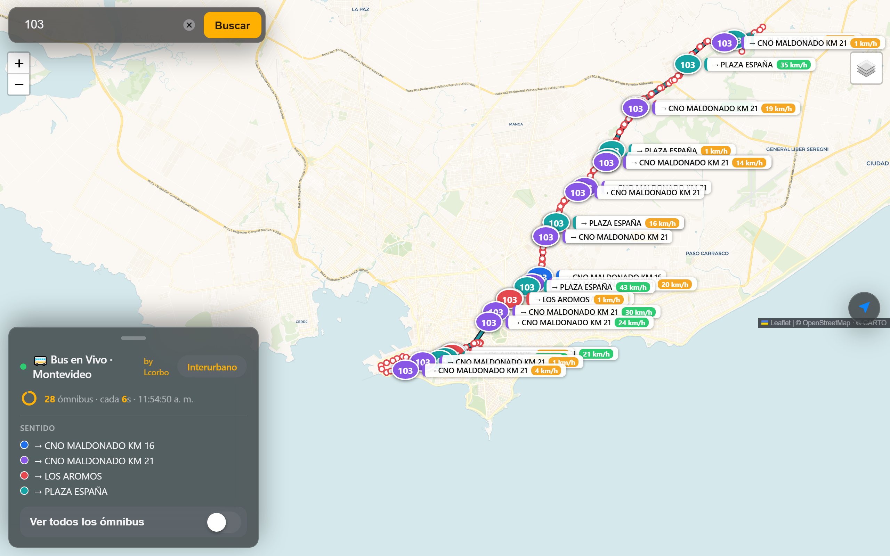
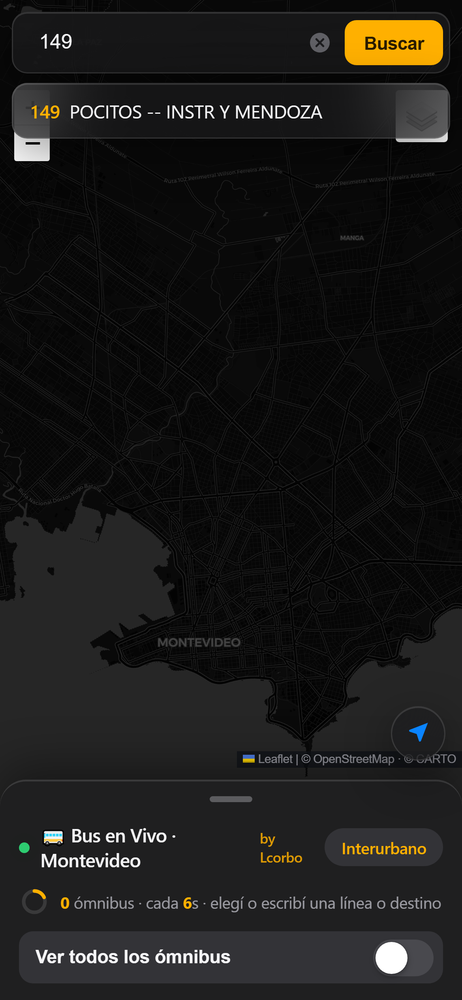
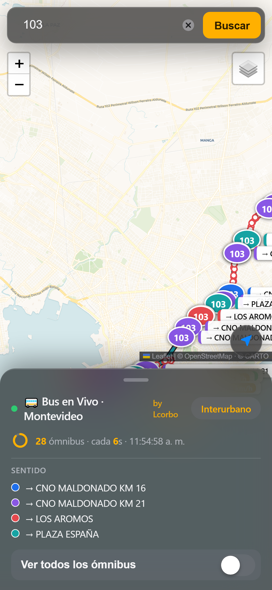
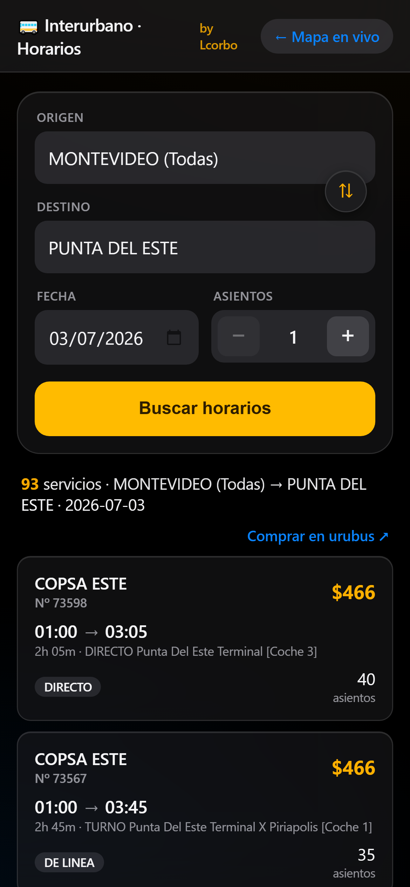
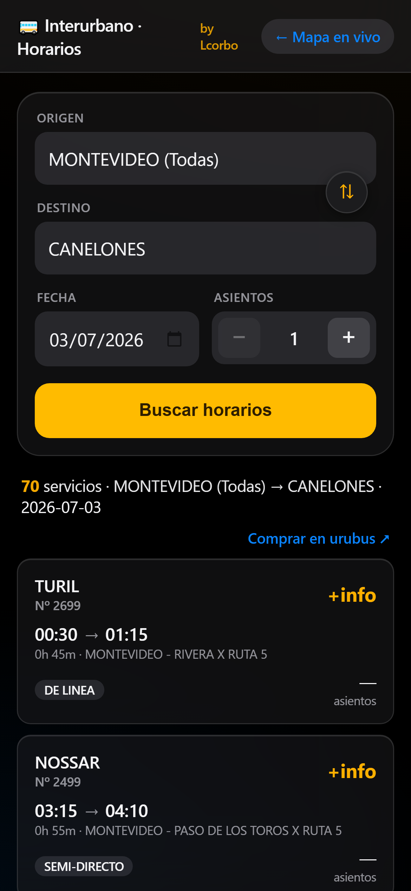

# 🚌 MiBondi · Buses de Montevideo en tiempo real

Aplicación web **ASP.NET Core MVC (C#)** que muestra sobre un mapa, **en tiempo real**, la
posición de los ómnibus del Sistema de Transporte Metropolitano (STM) de Montevideo, las
**paradas** por las que pasa cada línea y el **sentido** (ida/vuelta) de cada coche.

 

🌐 **En vivo:** https://www.MiBusCorbo.somee.com/

## ✨ Características

- 🗺️ **Mapa con 5 capas base**: **Mapa simple** (CARTO Voyager, *por defecto*) y **Mapa oscuro**
  (CARTO Dark Matter) —ambos limpios, estilo Google/Apple Maps—, más OpenStreetMap, Cartografía oficial de
  Montevideo (GeoServer WMS) y Satélite (Esri World Imagery), conmutables desde el selector de capas.
- ⏱️ **Auto-actualización cada 6 s** con un **contador circular tipo reloj** que muestra cuándo
  ocurre el próximo refresco.
- 🔎 **Buscador tipo combobox**: al escribir aparece un desplegable con las líneas que coinciden
  (por número o por destino). Búsqueda *case-insensitive* y sin acentos.
- 🔤 **Búsqueda por texto/destino**: ej. `149 ADUANA` filtra (del lado del cliente) los buses de
  la 149 cuyo destino se parece más a "ADUANA". El API solo filtra por número; el texto se
  resuelve visualmente por similitud.
- 🧭 **Sentido (ida/vuelta)**: cada destino distinto recibe un color; los buses se pintan según su
  sentido y se muestra una **leyenda**. La etiqueta de cada bus indica `→ DESTINO`.
- 🚏 **Paradas de la línea**: al buscar una línea se dibujan las paradas por las que pasa (overlay
  apagable con checkbox), con calle y esquina en el popup.
- 🛣️ **Recorrido por sentido**: traza la **ruta** que va a tomar cada bus (polilínea siguiendo las
  paradas en orden), **coloreada igual que el bus** según su sentido. Es un overlay apagable con
  checkbox ("Recorrido (sentido)"). Solo se dibujan las rutas de las variantes con buses activos.
- 🔵 **Marcadores informativos**: círculo con el número de línea + **badge de velocidad** (🔴
  detenido / 🟠 lento / 🟢 en movimiento).
- 🌐 **Todos los subsistemas**: Montevideo, Canelones, San José y Metropolitano (incluye líneas
  interdepartamentales como `Z4` o `2K`); el desplegable etiqueta el subsistema cuando no es
  Montevideo. *(Sin el parámetro `subsistema`, el endpoint de la STM solo devuelve Montevideo.)*
- 🎯 **Seguir un bus**: al tocar un coche, el mapa lo mantiene **centrado** en cada actualización
  (botón "Dejar de seguir" o clic en el mapa para soltarlo).
- 🚌 **Interurbano** (`/Home/Interurbano`): horarios de ómnibus **entre terminales de todo el país**
  (datos de urubus), con buscador de origen/destino (botón **⇅ para intercambiarlos**), fecha,
  **stepper de asientos**, **animación de carga** mientras busca y enlace de compra. Ver más abajo.
- 🔗 **Enlaces directos**: `…/#155` o `…/#149 ADUANA` precargan la búsqueda.
- 📱 **Diseño mobile-first estilo iOS/Apple**: mapa a pantalla completa, **buscador flotante** con
  botón ✕ para limpiar, **hoja inferior arrastrable** (deslizá hacia abajo para ocultarla) con los
  controles en la zona del pulgar, **FAB de "Mi ubicación"** (geolocalización) y materiales
  translúcidos (*vibrancy*). `100dvh`, *safe-area* y anti-zoom de iOS. "Ver todos" es un **interruptor**.
- 🧹 **Sin publicidad**: oculta el banner/branding que somee inyecta en el plan gratuito.
- 🚀 **Deploy automático** a somee por FTP en cada push a `main` (GitHub Actions).

## 📸 Capturas

Diseño **mobile-first estilo iOS** sobre el **mapa simple** (capa por defecto): el recorrido y el
**sentido (ida/vuelta)** de cada bus coloreados por destino, con la hoja inferior (leyenda + contador
en vivo + interruptor "Ver todos") y los badges de velocidad:



<p>
  &nbsp;
  
</p>

> Izquierda: **buscador flotante con autocompletado** y botón ✕ para limpiar. Derecha: **vista móvil**
> con la hoja inferior arrastrable, el FAB de "Mi ubicación", buses, recorrido y badge de velocidad.

### 🚌 Interurbano (horarios entre terminales)

Vista móvil (iPhone) de la búsqueda de horarios interurbanos: campos estilo iOS con **⇅ para
intercambiar** origen/destino y **stepper** de asientos; cada servicio con empresa, salida → llegada,
duración, categoría, asientos y precio, más el enlace **Comprar en urubus**:

<p>
  &nbsp;
  
</p>

> Ejemplos: **Montevideo → Punta del Este** y **Montevideo → Canelones**.

## 🚀 Cómo correrlo

Requisitos: [.NET SDK 10](https://dotnet.microsoft.com/download).

```bash
git clone https://github.com/lcorbo121/MiBondi.git
cd MiBondi
dotnet run
```

Abrí la URL que imprime la consola (por ej. `http://localhost:5147`), escribí una línea o
destino y elegí una sugerencia.

## 🏗️ Arquitectura (MVC)

| Capa | Archivo | Rol |
|------|---------|-----|
| **Model** | `Models/Bus.cs` | `Bus`, `LineaInfo`, `Parada`, `Recorrido` + DTOs de los GeoJSON |
| **Model** | `Models/Horario.cs` | `Terminal`, `CatalogoTerminales`, `Servicio`, `BusquedaHorarios` (interurbano) |
| **Service** | `Services/StmService.cs` | Cliente HTTP de la STM y del GeoServer (`IHttpClientFactory`) |
| **Service** | `Services/UrubusService.cs` | Cliente de urubus: parsea el HTML con **AngleSharp** + caché |
| **Controller** | `Controllers/HomeController.cs` | Sirve las vistas del mapa y del interurbano |
| **Controller (API)** | `Controllers/BusController.cs` | Endpoints JSON del mapa en vivo |
| **Controller (API)** | `Controllers/HorariosController.cs` | Endpoints JSON del interurbano |
| **View** | `Views/Home/Index.cshtml` | Mapa Leaflet, combobox, capas, colores y leyenda |
| **View** | `Views/Home/Interurbano.cshtml` | Buscador de horarios interurbanos (origen/destino/fecha) |

---

# 🔌 Endpoints

## A) API interna (la que expone esta app, en `BusController`)

El frontend **solo** habla con estos endpoints; el `StmService` se encarga de llamar a las
fuentes externas (así se evita CORS y se ocultan las URLs de origen).

### `GET /api/bus/posiciones?lineas=155,103`
- **Qué hace:** devuelve la posición en vivo de los ómnibus. Sin `lineas` devuelve todos.
- **Obtengo:** `{ ok, count, buses: [ { id, linea, sublinea, destino, tipoLinea, empresa, codigoBus, velocidad, lat, lng } ] }`
- **Cómo lo manejo:** el mapa lo consulta cada 6 s. Renderiza un marcador por bus, lo **colorea
  según `destino`** (sentido), arma la etiqueta `→ destino` y el badge de velocidad. Si se buscó
  texto (ej. `ADUANA`), filtra los buses por similitud del lado del cliente.
- **`subsistema`** (opcional, `-1` = todos por defecto): `1`=Montevideo, `2`=Canelones,
  `3`=San José, `4`=Metropolitano.

### `GET /api/bus/lineas`
- **Qué hace:** lista las líneas que están circulando (DataProvider del autocompletado).
- **Obtengo:** `{ ok, count, lineas: [ { linea, texto } ] }` (texto = sublínea representativa).
- **Cómo lo manejo:** se carga una vez al inicio. Alimenta el **combobox** (sugerencias al
  escribir) y sirve para resolver lo tipeado → código de línea exacto.

### `GET /api/bus/paradas?lineas=155,103`
- **Qué hace:** devuelve las paradas por las que pasa(n) la(s) línea(s).
- **Obtengo:** `{ ok, count, paradas: [ { cod, linea, calle, esquina, lat, lng } ] }`
- **Cómo lo manejo:** se dibujan como `circleMarker` al buscar una línea (se **cachea por
  línea**, no se recarga cada 2 s). Popup con `calle y esquina`. Es un overlay apagable.

### `GET /api/bus/recorridos?variantes=4145,8863`
- **Qué hace:** devuelve la **traza (ruta)** de cada variante: sus paradas en orden.
- **Obtengo:** `{ ok, count, recorridos: [ { variante, paradas: [ { cod, calle, esquina, lat, lng } ] } ] }`
  (las paradas vienen ordenadas por su `ordinal` en el recorrido).
- **Cómo lo manejo:** el frontend toma las **variantes que tienen buses activos** (cada bus trae
  su `variante` y `destino`), pide sus recorridos (se **cachea por set de variantes**) y dibuja una
  **polilínea por variante coloreada según el sentido** (mismo color que el bus). Overlay apagable.

## A.2) API interna del interurbano (en `HorariosController`)

### `GET /api/horarios/terminales`
- **Qué hace:** catálogo de terminales (orígenes y destinos) para los combobox.
- **Obtengo:** `{ ok, origenes:[{id,nombre}], destinos:[{id,nombre}] }` (~380 terminales).
- **Cómo lo manejo:** `UrubusService` lo saca del array `availableTags` de la home de urubus y lo
  **cachea 12 h**. Origen y destino comparten el mismo universo de terminales.

### `GET /api/horarios?from=83&to=101&fecha=2026-07-04&seats=1`
- **Qué hace:** busca servicios entre dos terminales para una fecha (solo ida).
- **Obtengo:** `{ ok, count, origen, destino, fecha, urlFuente, servicios:[ { empresa, numeroServicio,
  categoria, salida, llegada, origen, destino, duracion, precio, asientos, ruta, fechaHoraSalida } ] }`
- **Cómo lo manejo:** valida (IDs numéricos, origen ≠ destino, fecha no pasada), pide la página de
  urubus y la parsea; resultado **cacheado 8 min** por `(from,to,fecha,seats)`. `urlFuente` enlaza a
  la compra real en urubus.

## B) Fuentes externas (consumidas por `StmService` y `UrubusService`) — **no requieren API key**

### 0. Horarios interurbanos — urubus (scraping de HTML)
```
GET https://www.urubus.com.uy/es/omnibus-horarios?ter_from={id}&ter_to={id}&go_date=DD/MM/YYYY&seats=N
GET https://www.urubus.com.uy/                      (home: catálogo de terminales en `availableTags`)
```
- **Detalle:** la página renderiza los resultados **server-side** (sin auth ni token). Cada servicio
  es un `<div class="booking-item-container" empresa=… salida=… llegada=… precio=… asientos=…>`.
  *Uso personal/educativo.*
- **Cómo lo manejo:** `UrubusService` lee los bytes y decodifica UTF-8 a mano (urubus declara un
  `charset=UTF8` que .NET rechaza), parsea con **AngleSharp** los atributos del contenedor, **cachea**
  y expone JSON limpio. La compra real se deriva a urubus con `urlFuente`.

### 1. Posiciones en tiempo real — STM

### 1. Posiciones en tiempo real — STM
```
POST https://www.montevideo.gub.uy/buses/rest/stm-online
Content-Type: application/json
Body  {"subsistema":-1}                        -> todos los subsistemas
Body  {"subsistema":-1,"lineas":["155","103"]} -> solo esas líneas
```
> ⚠️ Sin `subsistema`, el endpoint responde **solo Montevideo** (subsistema 1) y deja afuera
> Canelones/San José/Metropolitano (líneas como `Z4`, `2K`). Por eso la app envía `subsistema:-1`.
- **Detalle:** con `GET` responde **405**; necesita `POST` JSON. Devuelve un **GeoJSON
  FeatureCollection**; cada feature trae en `properties`: `codigoEmpresa`, `codigoBus`, `linea`,
  `sublinea`, `tipoLineaDesc`, `destinoDesc`, `velocidad`, y en `geometry` un `Point` con
  `coordinates: [lng, lat]` (EPSG:4326).
- **Cómo lo manejo:** `StmService.GetBusesAsync` hace el POST, deserializa el GeoJSON a `Bus`
  (invirtiendo lng/lat). `GetLineasAsync` reutiliza la misma respuesta agrupando por `linea`
  para construir el DataProvider del autocompletado.

### 2. Variantes / recorridos — STM (recurso de apoyo)
```
GET https://www.montevideo.gub.uy/buses/rest/variantes
```
- **Detalle:** array de ~2150 variantes con `{ varianteCodigo, linea, lineaCodigo, origen,
  destino, sublinea, especial }`. Mapea **línea → variantes** con su `origen`/`destino`.
- **Cómo lo manejo:** se descubrió explorando endpoints hermanos del de posiciones. Confirma que
  el `variante` que trae cada bus coincide con el `cod_variante` del GeoServer y aporta el
  origen/destino de cada sentido. *En la app el sentido (ida/vuelta) se detecta directamente con
  el campo `destino` de `stm-online`*, por lo que este endpoint queda documentado como recurso
  disponible para futuras mejoras.

### 3. Paradas por línea — GeoServer (WFS)
```
GET https://geoserver.montevideo.gub.uy/geoserver/wfs
    ?service=WFS&version=2.0.0&request=GetFeature
    &typeNames=imm:v_uptu_paradas_con_horarios
    &outputFormat=application/json&srsName=EPSG:4326
    &cql_filter=desc_linea IN ('155','103')
```
- **Detalle:** GeoJSON de paradas. `properties`: `cod_ubic_parada`, `desc_linea`, `cod_variante`,
  `ordinal` (orden en el recorrido), `calle`, `esquina`; `geometry` = `Point [lng, lat]`.
- **Cómo lo manejo:** `StmService.GetParadasAsync` arma el `CQL_FILTER` (sanitizando las líneas a
  alfanumérico para evitar inyección), hace el GET y **deduplica por `cod_ubic_parada`** (una
  línea recorre varias variantes/sentidos y repite paradas).

### 4. Recorrido por variante — GeoServer (WFS)
```
GET https://geoserver.montevideo.gub.uy/geoserver/wfs
    ?service=WFS&version=2.0.0&request=GetFeature
    &typeNames=imm:Paradas_variantes_all
    &outputFormat=application/json&srsName=EPSG:4326
    &cql_filter=cod_variante IN (4145,8863)
```
- **Detalle:** mismas paradas pero **por variante** y con **cobertura completa** de variantes
  (`v_uptu_paradas_con_horarios` solo trae las que tienen horarios). `properties`: `cod_variante`,
  `ordinal`, `cod_ubic_parada`; `geometry` = `Point [lng, lat]`.
- **Cómo lo manejo:** `StmService.GetRecorridosAsync` filtra por `cod_variante`, **agrupa por
  variante y ordena por `ordinal`** para armar la secuencia de puntos de cada ruta. El frontend la
  dibuja como polilínea coloreada por sentido. Se usa esta capa (y no la de horarios) porque tiene
  todas las variantes.

### 5. Capas de mapa (tiles, directo desde Leaflet en el navegador)
| Capa | URL |
|------|-----|
| Mapa simple · CARTO Voyager **(default)** | `https://{s}.basemaps.cartocdn.com/rastertiles/voyager/{z}/{x}/{y}{r}.png` |
| Mapa oscuro · CARTO Dark Matter | `https://{s}.basemaps.cartocdn.com/dark_all/{z}/{x}/{y}{r}.png` |
| OpenStreetMap | `https://{s}.tile.openstreetmap.org/{z}/{x}/{y}.png` |
| Satélite (Esri World Imagery) | `https://server.arcgisonline.com/ArcGIS/rest/services/World_Imagery/MapServer/tile/{z}/{y}/{x}` |
| Cartografía Montevideo (WMS) | `https://geoserver.montevideo.gub.uy/geoserver/wms` · capa `stm_carto_basica` (`L.tileLayer.wms`) |

> 💡 Las capas/atributos del GeoServer se descubrieron con
> `…/geoserver/wfs?service=WFS&request=GetCapabilities` (buscando layers de *paradas/recorridos*).

## ⚙️ Configuración (`appsettings.json`)

```jsonc
"Stm":     { "Endpoint": "https://www.montevideo.gub.uy/buses/rest/stm-online" },
"Paradas": {
  "WfsUrl": "https://geoserver.montevideo.gub.uy/geoserver/wfs",
  "Layer":  "imm:v_uptu_paradas_con_horarios",   // paradas (con calle/esquina)
  "LayerVariantes": "imm:Paradas_variantes_all"  // recorrido por variante (cobertura completa)
},
"Mapa": {
  "WmsUrl": "https://geoserver.montevideo.gub.uy/geoserver/wms",
  "WmsLayer": "stm_carto_basica",
  "CentroLat": -34.8721, "CentroLng": -56.1819, "Zoom": 12,
  "RefrescoSegundos": 6
},
"Urubus": {                                         // horarios interurbanos
  "BaseUrl": "https://www.urubus.com.uy",
  "TerminalesHoras": 12,                            // TTL de caché del catálogo
  "ResultadosMinutos": 8                            // TTL de caché de cada búsqueda
}
```

## 🚀 Deploy automático (GitHub Actions → somee)

`.github/workflows/deploy.yml` se ejecuta en cada push a `main`: publica *self-contained*
(multi-archivo, requisito de IIS), sube un `app_offline.htm` para **liberar los locks** de IIS,
sube todo por FTP y lo elimina para reiniciar la app. Credenciales en *secrets*
(`SOMEE_FTP_USERNAME`, `SOMEE_FTP_PASSWORD`).

## 🛠️ Stack

ASP.NET Core MVC · C# / .NET 10 · Leaflet · GeoJSON · WFS/WMS (GeoServer) · AngleSharp · GitHub Actions.
